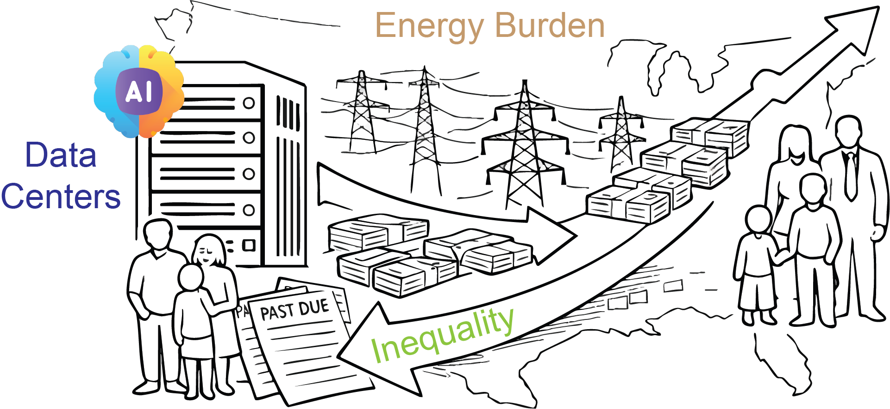
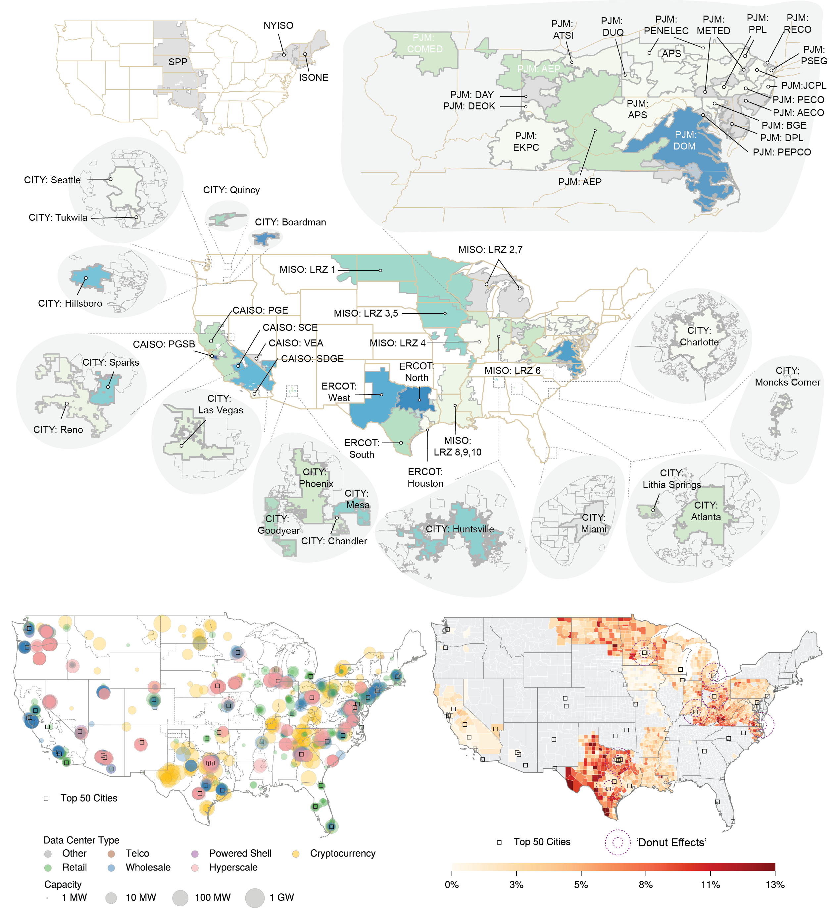
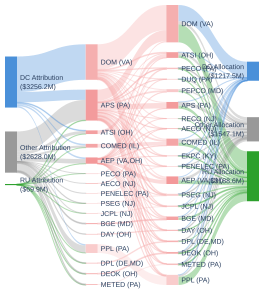
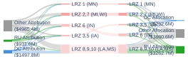
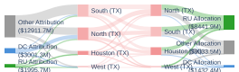
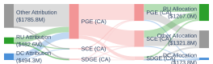

# Data Center-Driven Energy Burden and Inequality

<p align="center">
  
</p>

<p align="center">
  <em>Replication code and data for quantifying how data-center load growth affects wholesale electricity prices, transmission cost allocation, and downstream energy burden and distributional outcomes across the United States.</em>
</p>

---

## Zones and Data Center Locations

<p align="center">
  
</p>

---

## Transmission Cost Allocation (Interactive Sankey Diagrams)

Static previews are shown below. Click any diagram to open the **interactive version** with year-selector dropdown.

<p align="center">
  <a href="https://VictorCFeng.github.io/Data-Center-Equality/figures/PJM_sankey.html">
    
  </a>
  <a href="https://VictorCFeng.github.io/Data-Center-Equality/figures/MISO_sankey.html">
    
  </a>
</p>
<p align="center">
  <a href="https://VictorCFeng.github.io/Data-Center-Equality/figures/ERCOT_sankey.html">
    
  </a>
  <a href="https://VictorCFeng.github.io/Data-Center-Equality/figures/CAISO_sankey.html">
    
  </a>
</p>

---

## 1. System Requirements

### Software Dependencies

| Package | Version | Purpose |
|---------|---------|---------|
| Python | 3.11.x | Runtime (matplotlib 3.4.x is incompatible with Python 3.12+) |
| numpy | 1.26.4 | Numerical computation |
| pandas | 2.3.1 | Data manipulation |
| matplotlib | 3.4.3 | Static plotting |
| proplot | 0.9.7 | Publication-quality figures |
| plotly | 6.2.0 | Interactive Sankey diagrams |
| scipy | 1.15.2 | Statistical functions |
| statsmodels | 0.14.5 | Econometric models |
| linearmodels | 6.1 | Panel data / IV regression |
| openpyxl | 3.1.5 | Excel I/O |
| kaleido | 1.1.0 | Plotly static image export |
| csdid | 0.2.9 | Callaway-Sant'Anna staggered DiD |
| drdid | 1.1.6 | Doubly-robust DiD |
| adjustText | 1.3.0 | Label placement |
| xlsxwriter | 3.2.9 | Excel output |

Full pinned versions are in [`requirements.txt`](requirements.txt).

### Tested On

| OS | Version |
|----|---------|
| macOS | Sequoia 15.5 (Apple Silicon) |
| Ubuntu | 24.04 LTS (x86_64, AWS EC2 t2.xlarge) |

### Hardware

- No GPU or non-standard hardware required.
- Recommended: 16 GB RAM for the full energy burden pipeline (Pipeline 3 processes ~790 MB of DOE LEAD data across 51 states).
- A standard laptop or desktop is sufficient.

---

## 2. Installation Guide

### Instructions

```bash
# 1. Create a conda environment with Python 3.11
conda create -n dc_replication python=3.11 -y
conda activate dc_replication

# 2. Clone this repository
git clone https://github.com/VictorCFeng/Data-Center-Equality.git
cd Data-Center-Equality

# 3. Install all dependencies
pip install -r requirements.txt
```

### Typical Install Time

Under **5 minutes** on a normal desktop computer with a broadband internet connection.

---

## 3. Demo

A quick demo can be run using the **pre-computed results** included in `results/`. The figure scripts (Pipeline 5) read these pre-computed outputs and generate publication figures without needing to run the upstream regression and simulation pipelines.

### Instructions

```bash
cd Data-Center-Equality

# Generate all figures from pre-computed results
for fig in figure_scripts/f*.py; do
    python "$fig"
done
```

### Expected Output

Figures are saved to `figures_revised/` in subdirectories organized by paper section:

| Subdirectory | Contents |
|-------------|----------|
| `01-2/` | Price impact scatter plots, cross-sectional analysis |
| `03/` | Sankey diagrams: static SVG + interactive HTML |
| `04/` | Energy burden bubble charts, income scatter, rural scatter |
| `05/` | Employment effects: forest plots, multiplier, construction, substitution, fiscal |
| `06/` | Sensitivity analysis and waterfall diagrams |

### Expected Run Time

Under **2 minutes** on a normal desktop computer.

---

## 4. Instructions for Use

### Full Reproduction

All scripts should be run from the repository root as the working directory. The five pipelines must be run in order, as later pipelines depend on outputs from earlier ones.

#### Pipeline 1: Bartik IV Regression (Sections 3-4)

Estimates the causal effect of data center capacity on wholesale electricity prices using a Bartik shift-share instrumental variable strategy.

```bash
# Step 1: Share exogeneity tests
python r02_share_exogeneity_test.py

# Step 2: Core IV regressions (ISO zones + non-ISO cities)
python r02_bartik_iv_workflow.py --iso ALL
python r02_city_bartik_iv_workflow.py

# Step 3: Summary tables
python r02_summary.py

# Step 4: Cross-sectional heterogeneity analysis
python r02_cross_sectional.py
```

**Outputs:** `results/r2_share_exogeneity/`, `results/r3_summary/`, `results/r3_cross_sectional/`

#### Pipeline 2: Transmission Cost Allocation (Section 4)

Decomposes transmission costs into load-growth attribution and existing-load allocation for residential, data center, and other customers.

```bash
python r03_sankey.py
```

**Outputs:** `results/sankey/{ISO}_attribution.csv`, `results/sankey/{ISO}_allocation.csv`

#### Pipeline 3: Energy Burden Analysis (Section 5)

Counterfactual simulation of how DC-induced price increases propagate to household energy burdens across U.S. counties. Scripts must be run in the order shown below.

```bash
# Step 1: ISO-level retail cost breakdown
python r04_ISO_breakdown.py

# Step 2: Baseline and DC-scenario energy burdens (can run in parallel)
python r04_bench_burden.py
python r04_dc_burden.py

# Step 3-6: Downstream analyses (must run sequentially after Steps 1-2)
python r04_income_ami.py
python r04_compare_poverty.py
python r04_rural_merge.py
python r04_state_merge.py
```

**Outputs:** `rider/bench/`, `rider/dc/`, `rider/compare/`, `rider/income/`, `rider/rural/`

#### Pipeline 4: Employment Analysis (Section 6)

State-level analysis of data center employment effects using Census QWI data.

```bash
python r05_ols_employment_dc.py
python r05_substitution_analysis.py
python r05_construction_analysis.py
python r05_labor_income_vs_subsidy.py
python r05_staggered_did.py
```

**Outputs:** `employment/*.xlsx`

#### Pipeline 5: Figures

Generate all publication figures. Run after Pipelines 1-4 are complete.

```bash
for fig in figure_scripts/f*.py; do
    python "$fig"
done
```

**Outputs:** `figures_revised/`

### Expected Run Time (Full Reproduction)

Approximately **20 minutes** on a standard desktop computer. The energy burden pipeline (Pipeline 3, Steps 3a/3b) is the most time-intensive component (~10 minutes), as it processes household-level energy expenditure data for all 51 states.

---

## Directory Structure

```
.
├── r02_share_exogeneity_test.py      # Bartik IV share exogeneity tests
├── r02_bartik_iv_workflow.py         # Bartik IV 2SLS (ISO zones)
├── r02_city_bartik_iv_workflow.py    # Bartik IV 2SLS (non-ISO cities)
├── r02_summary.py                   # Summary tables from IV results
├── r02_cross_sectional.py           # Cross-sectional heterogeneity analysis
├── r03_sankey.py                    # Transmission cost Sankey attribution/allocation
├── r04_ISO_breakdown.py             # ISO-level cost breakdown
├── r04_bench_burden.py              # Baseline energy burden simulation
├── r04_dc_burden.py                 # DC-scenario energy burden simulation
├── r04_income_ami.py                # Income and AMI stratification
├── r04_compare_poverty.py           # Energy poverty comparison
├── r04_rural_merge.py               # Rural-urban heterogeneity merge
├── r04_state_merge.py               # State-level data merge
├── r05_ols_employment_dc.py         # Employment OLS by DC capacity
├── r05_substitution_analysis.py     # Intra-industry substitution
├── r05_construction_analysis.py     # Construction employment
├── r05_labor_income_vs_subsidy.py   # Labor income vs fiscal incentives
├── r05_staggered_did.py             # Callaway-Sant'Anna staggered DiD
│
├── figure_scripts/                  # Figure generation scripts (Pipeline 5)
├── tables/                          # ISO-zone panel data (prices, demand, capacity, fuel)
├── tables_city/                     # City-level panel data
├── load_and_costs/                  # ISO load forecasts and transmission project data
├── allocation/                      # Utility tariff filings and cost allocation source data
├── econ_and_ai/                     # Economic indicators, AI adoption, DOE LEAD data
├── employment/                      # Census QWI employment data and regression outputs
├── rider/                           # Energy burden data, EIA forecasts, county mappings
├── LTRS/                            # NERC reliability assessments (LTRA, SRA)
├── results/                         # Pre-computed outputs (allows figure-only demo)
├── figures/                         # Sankey interactive HTML + static SVG for README
└── requirements.txt                 # Pinned Python dependencies
```

---

## Data Sources

### `tables/` — ISO-Zone Panel Data

Primary inputs for Pipeline 1 (Bartik IV regressions). Compiled from EIA and ISO public reports.

| File | Description |
|------|-------------|
| `yearly_price.xlsx` | Annual wholesale electricity prices by zone, pre-2020 ($/MWh) |
| `demand_raw.xlsx` | Hourly electricity load by zone (MW) |
| `dc_cumulative_by_iso.xlsx` | Cumulative data center capacity by ISO-zone-year (MW) |
| `capacity_by_iso.xlsx` | Monthly generation capacity by balancing authority (MW) |
| `fuel_price.xlsx` | Daily natural gas prices by ISO ($/MMBtu) |
| `fuel_mix.xlsx` | Hourly generation dispatch by fuel type and ISO (MW) |
| `fuel_marginal.xlsx` | Hourly marginal fuel composition and gas price by ISO |
| `price.xlsx` | Hourly wholesale electricity prices by zone ($/MWh) |
| `temperature_filled.xlsx` | Hourly temperature data by zone (°F, gap-filled) |
| `datacenter_sum.xlsx` | Annual data center capacity by zone (MW) |

### `tables_city/` — City-Level Panel Data

Same structure as `tables/`, adapted for non-ISO cities (Atlanta, Charlotte, Hillsboro, Mesa, Phoenix, Seattle, etc.).

| File | Description |
|------|-------------|
| `yearly_price.xlsx` | Annual wholesale electricity prices by city, pre-2020 ($/MWh) |
| `city_prices.xlsx` | Hourly wholesale electricity prices by city ($/MWh) |
| `city_fuel.xlsx` | Daily natural gas prices by city ($/MMBtu) |
| `city_temp.xlsx` | Hourly temperature data by city (°F) |
| `city_dc.xlsx` | Annual data center capacity by city (MW) |
| `dc_cumulative_by_city.xlsx` | Cumulative data center capacity by city-year (MW) |
| `data_centers_city_agg.xlsx` | Data center facility counts and capacity by city |
| `city.xlsx` | City metadata: pricing nodes, operators, gas hubs |

### `load_and_costs/` — ISO Load Forecasts and Transmission Projects

Raw data on load forecasts, load factors, and transmission project costs for each ISO (CAISO, ERCOT, MISO, PJM). Each ISO subdirectory contains:

| File | Description |
|------|-------------|
| `00_{ISO}_share.xlsx` | Data center load share by pricing zone |
| `01_load_factor.xlsx` | Peak-to-load ratios by zone and customer class |
| `02_load_by_zone_and_class.xlsx` | Annual load by zone and customer class (residential, commercial, industrial, GWh) |
| `03_projects.xlsx` | Transmission project costs ($M), zone-level responsibility shares, and allocation shares |
| `LTLP/` or `LTLF/` | Long-term load planning/forecast source documents |
| `Projects/` | Transmission project planning source documents and raw data |

See `load_and_costs/{ISO}/README.md` for ISO-specific documentation.

### `allocation/` — Utility Tariff and Cost Allocation Data

Utility-level rate case filings and tariff documents used to determine how transmission costs are allocated across customer classes (residential, commercial, industrial/DC).

| Item | Description |
|------|-------------|
| `utilities.xlsx` | Master utility list: maps utilities to ISOs, zones, and states |
| `{ISO}/00_{ISO}_share.xlsx` | DC load share by zone (compiled summary) |
| `{ISO}/{zone}/` | Zone-level annual tariff PDFs and rate case filings |
| `ERCOT/COSS/` | Cost of Service Studies by T&D utility (AEP, CenterPoint, ONCOR) |
| `city/` | Non-ISO city utility tariff filings |

### `econ_and_ai/` — Economic and AI Adoption Data

| Item | Description |
|------|-------------|
| `LEAD/` | 51 state-level CSVs (~790 MB) of household energy expenditure, income, and housing characteristics |
| `state_accept/state_ai.xlsx` | State-level AI tool adoption rates |
| `state_accept/state_bb.xlsx` | State-level broadband coverage |
| `state_accept/state_dc_capacity.xlsx` | State-level data center capacity |
| `state_accept/state_gdp.xlsx` | State-level GDP |
| `macroeconomic.xlsx` | State-level macroeconomic indicators |
| `fuel/` | State-level fuel prices |

### `rider/` — Energy Burden and Rate Rider Data

| Item | Description |
|------|-------------|
| `EIA/EIA_AEO2023_prices_by_service.xlsx` | Retail electricity price projections by service territory |
| `EIA/EIA_AEO2025_prices_by_service.xlsx` | Retail electricity price projections by service territory |
| `EIA/{ISO}_zone_prices.xlsx` | Zone-level retail price decomposition (generation, transmission, distribution) |
| `burden/county_to_iso_or_city.csv` | Pre-computed county-to-ISO/city spatial mapping |
| `rural/Ruralurban.xlsx` | Rural-Urban Continuum Codes (RUCC 2023) |

### `employment/` — Employment Data

| File | Description |
|------|-------------|
| `qwi_all_naics_annual.csv` | Quarterly Workforce Indicators, annual aggregation by state and NAICS code |
| `dc_facilities_by_state_year.csv` | Data center facility counts by state-year |
| `pwc_multipliers.csv` | Economic multipliers for data center employment |
| `pwc_state_data.csv` | State-level data center economic impact |
| `tax/state_subsidy_by_year_million_wide.xlsx` | State fiscal incentives for data centers ($M by year) |

### `LTRS/` — NERC Reliability Assessments

| File | Description |
|------|-------------|
| `LTRA.xlsx` | Compiled EEU, LOLH, and reserve margins by assessment area |
| `SRA.xlsx` | Compiled seasonal reliability metrics |
| `long-term/nerc_ltra_{year}.pdf` | Source LTRA reports |
| `summer/nerc_sra_{year}.pdf` | Source SRA reports |

---

## License

Code in this repository is released under the [MIT License](LICENSE). Data are compiled from public datasets, ISO/RTO market data, and regulatory filings; users are responsible for complying with any upstream licensing requirements.

---

## Contact

For questions about the data or code, please open a [GitHub issue](https://github.com/VictorCFeng/Data-Center-Equality/issues) or contact: chengfeng@cornell.edu
